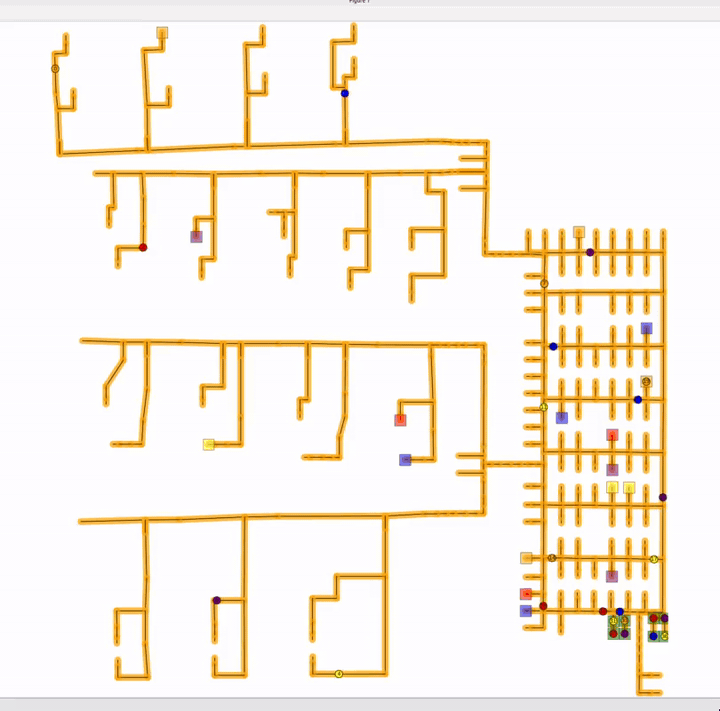
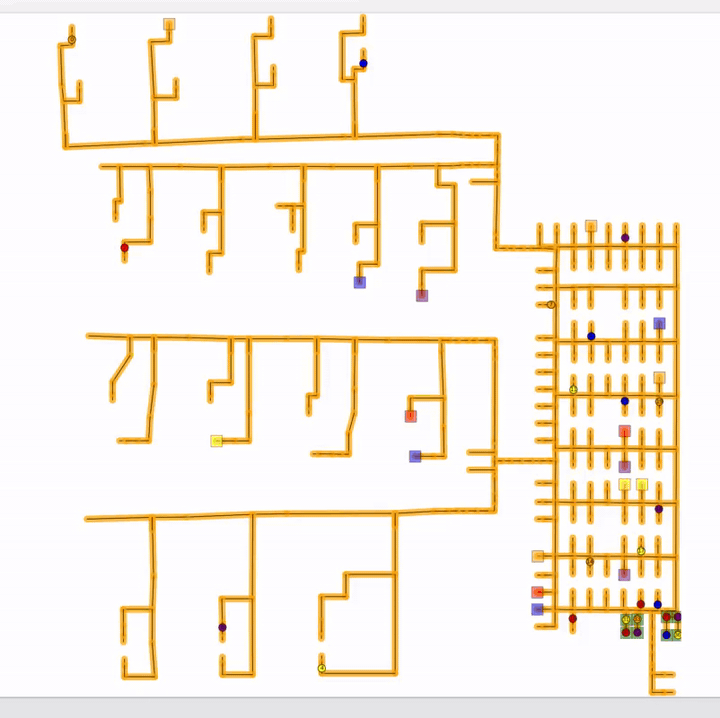

# Multi-Agent Path Planning — Warehouse Research & Test

## About

A quick research and testing workspace for Multi-Agent Path Finding (MAPF) algorithms applied to warehouse environments, with a focus on evaluating their feasibility for **real production warehouse deployments** — including roadmap-based navigation, continuous-time scheduling, and lifelong task assignment.

The repo collects several state-of-the-art MAPF solvers (CBS variants, lifelong MAPF, continuous-time CBS, etc.) and a lightweight Python reference implementation. Each subdirectory is a fork of an upstream project, extended with local notes, warehouse-specific test data, and visualization scripts. Algorithms are tested against real warehouse map data (roadmap XML format) to assess practical performance under production constraints such as narrow corridors, large agent counts, and online task streams.

**Algorithms covered**

| Directory | Algorithm | Type |
|-----------|-----------|------|
| [CBSH2-RTC](warehouse/CBSH2-RTC/) | CBS with heuristics, rectangle/target/corridor reasoning | Optimal, grid & roadmap |
| [Continuous-CBS](warehouse/Continuous-CBS/) | CCBS — continuous-time CBS on general graphs | Optimal, roadmap |
| [EECBS](warehouse/EECBS/) | Explicit Estimation CBS | Bounded-suboptimal |
| [libMultiRobotPlanning](warehouse/libMultiRobotPlanning/) | C++ MAPF/task-planning library (CBS, ECBS, …) | Library, roadmap |
| [multi\_agent\_path\_planning](warehouse/multi_agent_path_planning/) | Python implementations of CBS, SIPP, etc. | Reference / prototyping |
| [RHCR](warehouse/RHCR/) | Rolling-Horizon Collision Resolution (lifelong MAPF) | Lifelong, large-scale |
| [s2m2](warehouse/s2m2/) | Scalable & Safe Multi-Agent Motion Planner | Nonlinear dynamics |

---

## Demo

The warehouse map is modelled as a **directed graph** (roadmap): nodes are waypoints and edges are one-way lanes, reflecting real fork-lift/AMR routing constraints. All solvers are tested on this directed roadmap format.

### CBSH2-RTC

| | |
|---|---|
|  |  |

### REC

| | |
|---|---|
|  |  |

### Old map

| | |
|---|---|
|  |  |
| .gif>) | .gif>) |

---

## Installation

Each subdirectory has its own build instructions. See the links below:

| Project | Build & usage guide |
|---------|---------------------|
| CBSH2-RTC | [README.md](warehouse/CBSH2-RTC/README.md) · [local notes](warehouse/CBSH2-RTC/LOCAL_README.md) |
| Continuous-CBS | [README.md](warehouse/Continuous-CBS/README.md) · [local notes](warehouse/Continuous-CBS/LOCAL_README.md) |
| EECBS | [README.md](warehouse/EECBS/README.md) · [local notes](warehouse/EECBS/LOCAL_README.md) |
| libMultiRobotPlanning | [README.md](warehouse/libMultiRobotPlanning/README.md) · [local notes](warehouse/libMultiRobotPlanning/LOCAL_README.md) |
| multi\_agent\_path\_planning | [README.md](warehouse/multi_agent_path_planning/README.md) · [local notes](warehouse/multi_agent_path_planning/LOCAL_README.md) |
| RHCR | [README.md](warehouse/RHCR/README.md) · [local notes](warehouse/RHCR/LOCAL_README.md) |
| s2m2 | [README.md](warehouse/s2m2/README.md) · [local notes](warehouse/s2m2/LOCAL_README.md) |

Common dependencies: **Boost** (`sudo apt install libboost-all-dev`), **CMake ≥ 3.10**, **Python 3**.

---

## Acknowledgments

Each subdirectory is forked from the original upstream repository. All credit for the core algorithms and implementations goes to the original authors.

| Fork | Original repository |
|------|---------------------|
| CBSH2-RTC | [Jiaoyang-Li/CBSH2-RTC](https://github.com/Jiaoyang-Li/CBSH2-RTC) |
| Continuous-CBS | [PathPlanning/Continuous-CBS](https://github.com/PathPlanning/Continuous-CBS) |
| EECBS | [Jiaoyang-Li/EECBS](https://github.com/Jiaoyang-Li/EECBS) |
| libMultiRobotPlanning | [whoenig/libMultiRobotPlanning](https://github.com/whoenig/libMultiRobotPlanning) |
| multi\_agent\_path\_planning | [atb033/multi\_agent\_path\_planning](https://github.com/atb033/multi_agent_path_planning) |
| RHCR | [Jiaoyang-Li/RHCR](https://github.com/Jiaoyang-Li/RHCR) |
| s2m2 | [jkchengh/s2m2](https://github.com/jkchengh/s2m2) |
